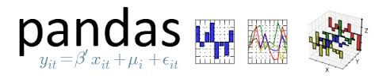

## Seattle Housing Market Exploration

This repo explores housing market trends by neighborhood in Seattle.

### Data collection

##### Housing value data
Housing value data were collected from the King County Tax Assessor using BeautifulSoup and Mechanize. The tax assessor data for each home includes the following:
* address
* number of bedrooms
* number of bathrooms
* lot size
* year build_permit_array
* yearly assessed value

##### Seattle permits and shape files

Construction permit data and neighborhood shape files are available at data.seattle.gov.
* neighborhood and park shape files: https://data.seattle.gov/dataset/data-seattle-gov-GIS-shapefile-datasets/f7tb-rnup
* building permits: https://data.seattle.gov/Permitting/Building-Permits-Current/mags-97de

### Data Preparation

The dataset is loaded into a pandas dataframe for analysis.
